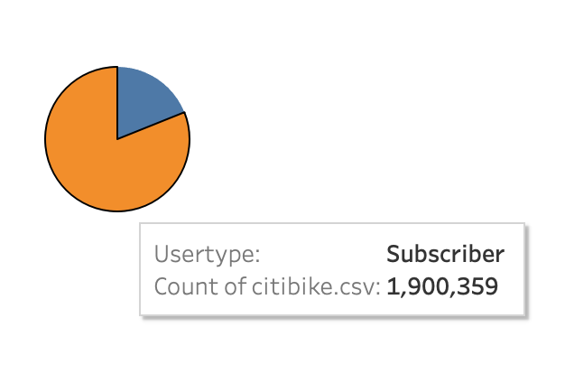
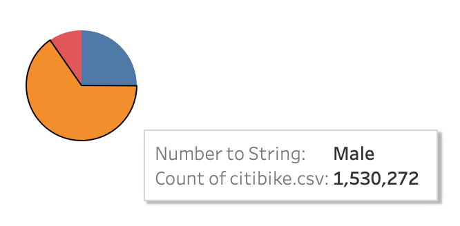
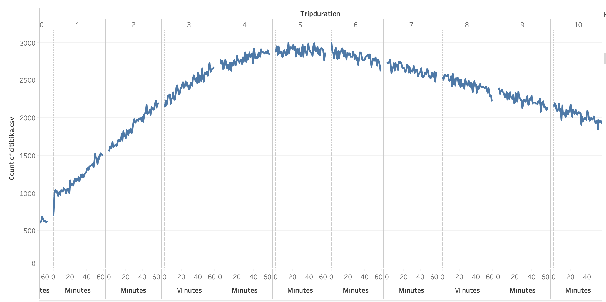
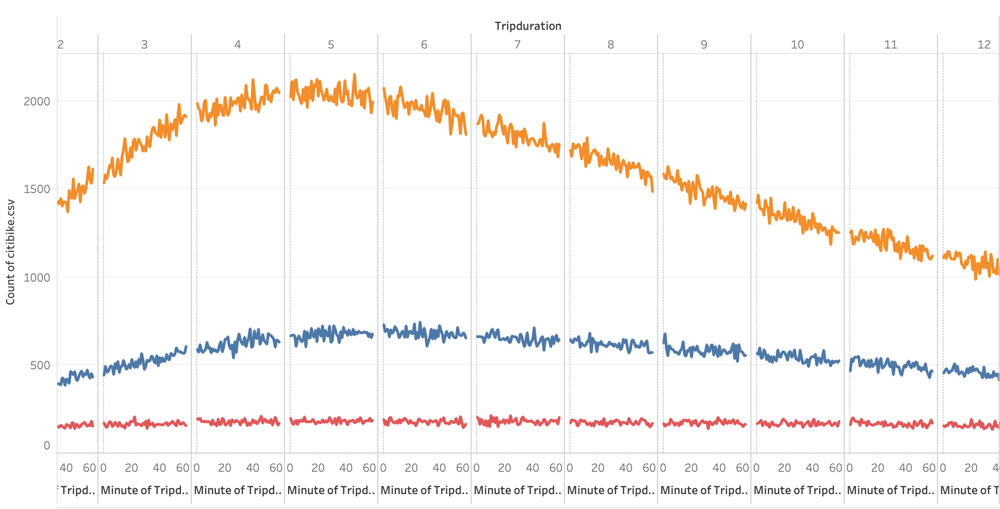
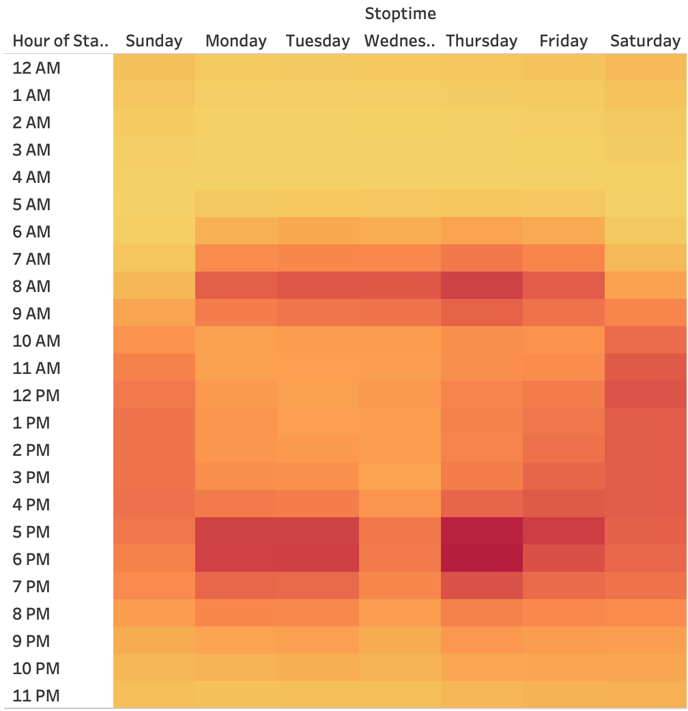
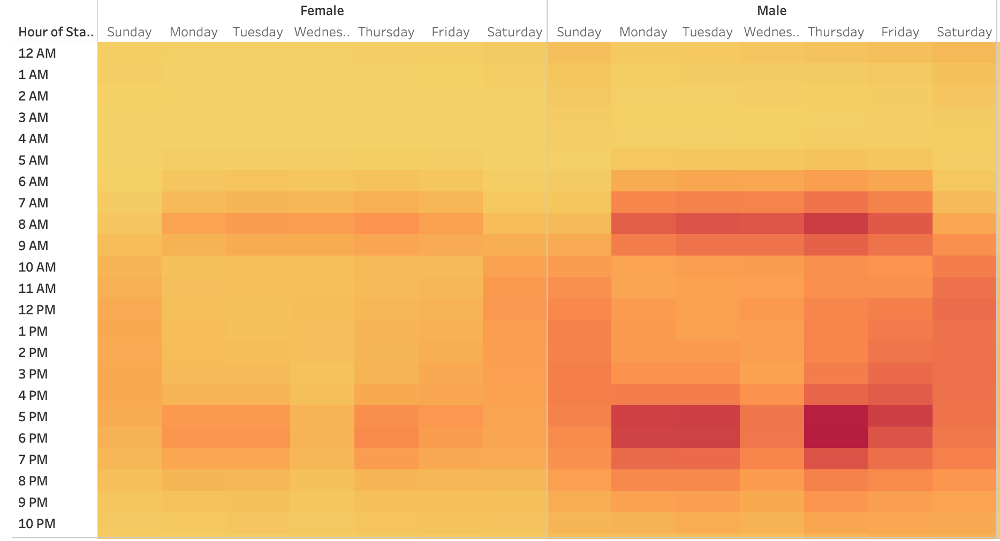
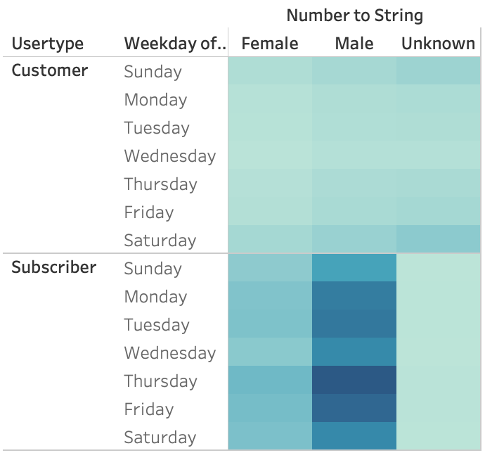

# Bike Sharing

## Project Overview
The purpose of this project is to provide visualizations to show investors that bike sharing will be a success in Iowa. We were to provide visualizations on most popular start and stop locations and times, breakdown of riders by customer type and gender, length of trip durations, and peak times and days for bike sharing. Using Tableau, I created a story to display the different visualizations all together to present to investors. 

## Results
Number of Riders:
- The total number of riders in the dataset was 2,344,224.

Customer Types:
- 81% of riders are Citibike Subscribers, while the other 19% are one-time customers.

Gender Breakdown:
- 65% of riders were Male
- 25% of riders were Female
- The remaining 10% of riders' gender was unknown

Trip Durations for Citibike Users:
- The trip durations for users lay in a bell curve shape, with the majority of trips lasting from 4-6 hours.
- The distribution is skewed left.

Trip Durations by Gender:
- Each gender follows a similar pattern to the overall bell curve, with a peak at 4-6 hours.

Trips by Weekday:
- Peak hours are at both 8am Monday through Friday, and 5-6pm Monday through Friday.
- It is safe to assume that the highest demand for bike sharing is for commuting to and from work.
- Saturday and Sunday from 11am to 6pm also have high demand.

Trips by Gender and Weekday:
- Male riders make up majority of the rider population, so it follows the same pattern as general trips by weekday.
- Female riders follow this pattern as well.

Trips by User Type and Gender:
- Male subscribers make up majority of the ride count, with majority of rides on Thursday, Friday, and Tuesday.

## Summary
The main takeaways from conducting this analysis were:
1. Peak times are 8am, 5pm, and 6pm on weekdays, and 11am to 5pm on weekends.
2. Majority of riders are male.
3. Majority of riders are Citibike Subscribers, as opposed to one-time users.
4. Majority of trips last from 2-9 hours, with a peak at 4-6 hours.
5. Bike maintenance and repairs should be made at the least busy hours, which is around 2-4am.

Two additional visualizations that could be helpful: 
1. Top starting and stopping locations, to get insight on the best locations for the bike stations.
2. Riders by age, to get a better idea of the customer base.
